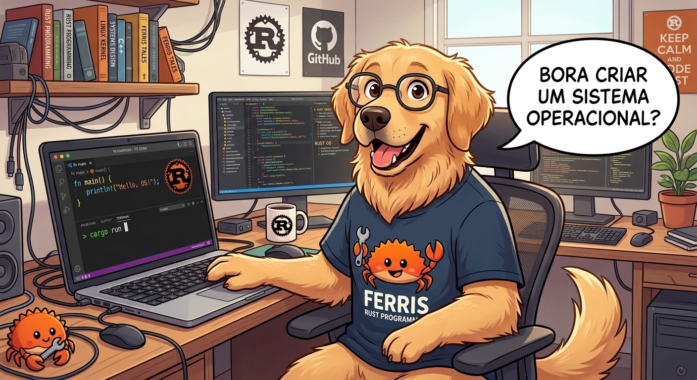

# os-rust

```text
                    #####
                   // : \\
                ..-  --:  -..
           //--/ .:==███==+. \--\\
          //-\ +- ███ █ ███ -+ /-\\
           \\ | ██  @@@@@  ██ | //
            | | @  @     @  @ | |
            | | @██@ ███ @██@ | |
            | | @  @@@@@@   @ | |
           // | ██ @  █  % ██ | \\
          \\.- -- ███ █ ███ -- -.//
           \\--\. -- ███ -- ./--//
                 --. -.- .--
                   \\ : //
                    #####
                                         []
 .o:o.   .s::.       [.o= []  |]   .s:: =++=t
[o   o] [:___  ===== [r   []  |]  [:___  []
[o   o]     :]       []   []  |]      :] []
  o:o   ::__:        []    uu/|]  ::__:   \ut
```



O os-rust começou como uma demonstração mínima de "programação sem
sistema operacional" em Rust: um binário que dá boot direto via BIOS em
uma máquina virtual QEMU, escreve texto na tela usando o buffer de vídeo
VGA e lê o teclado via interrupção de hardware (IRQ1) para alimentar um
prompt de comandos mínimo, sem nenhum sistema operacional por baixo. A
partir daqui, o projeto passa a evoluir em etapas pequenas rumo a um
objetivo maior: veja a seção Visão logo abaixo.

Se você nunca viu como um kernel/bootloader funciona, leia também o
[`WALKTHROUGH.md`](./WALKTHROUGH.md): ele explica o que está acontecendo
por trás do boot e do código.

## Visão

O objetivo central do os-rust é permitir que alguém escreva um programa,
compile esse programa separadamente do kernel e o execute no os-rust, em
modo usuário, usando uma interface de programação documentada. Não é um
kernel de propósito geral: é um kernel educacional que evolui por marcos
pequenos, cada um pensado para caber em uma aula, sempre priorizando o
caminho mais curto até rodar programas de usuário antes de recursos como
sistema de arquivos ou multitarefa completa.

## Status

**Versão atual: 0.4.1.** Os Marcos 0 (boot em modo texto VGA, com
mensagem de boas-vindas, rolagem e tratamento de panic legível), 1
(interrupções, teclado e prompt de comandos), 2 (infraestrutura de
depuração: saída serial e testes automatizados dentro do QEMU), 3
(memória: alocador de frames físicos, paginação e heap do kernel), 4
(proteção: GDT e TSS próprias, handlers para as exceções principais,
double fault com pilha dedicada) e 4.1 (nova identidade: o projeto passa
a se chamar os-rust, com o logo acima aparecendo na tela a cada boot)
estão concluídos e são o que este repositório executa hoje. Os Marcos 5
em diante continuam planejados. A demonstração original de palestra, no
formato usado em aula, está preservada na tag git `v1.0-demo` e continua
podendo ser usada como está.

## Roadmap

O os-rust avança em marcos numerados, cada um terminando em algo visível
no QEMU. A tabela abaixo resume os onze primeiros marcos planejados; os
detalhes de cada um vêm na sequência.

| Marco | Objetivo | Demonstrável | Status |
|---|---|---|---|
| 0. Boot e texto VGA | Dar boot via BIOS e escrever texto em modo VGA, com tratamento de panic legível. | Mensagem de boas-vindas, rolagem de texto e uma tela de panic legível. | Concluído |
| 1. Interrupções, teclado e prompt | Tratar interrupções de hardware, ler o teclado e oferecer um prompt de comandos fixos. | Digitar `help` no prompt e ver a resposta. | Concluído |
| 2. Infraestrutura de depuração | Ter saída serial e testes automatizados rodando dentro do QEMU. | `cargo test` executando testes do kernel dentro do QEMU. | Concluído |
| 3. Memória | Alocar frames físicos e páginas, e ter um alocador de heap dentro do kernel. | `Vec` e `Box` funcionando dentro do kernel, visíveis por um comando do prompt. | Concluído |
| 4. Proteção | Ter GDT e TSS próprias e tratar as exceções principais, incluindo page fault e double fault com pilha dedicada. | Provocar um page fault e ver uma mensagem legível em vez de reboot. | Concluído |
| 4.1. Nova identidade | Renomear o projeto para os-rust em todo lugar (pacote, crate, target, pastas, prompt, mensagens, documentação) e acrescentar o logo na tela de boot e no README. | `cargo run` mostra o logo, depois `os-rust v0.4.1` e o prompt `os-rust> `. | Concluído |
| **5. Primeiro programa de usuário (marco central)** | Rodar o primeiro programa de usuário em modo protegido (ring 3), usando um mecanismo de syscall e um carregador de executáveis ELF64 embutidos na imagem de boot. | Comando `run hello` no prompt executa um programa em modo usuário que imprime na tela e retorna ao prompt. | Planejado |
| 6. Interface de programação | Ampliar o contrato de syscalls (teclado, memória, código de saída) e oferecer uma biblioteca de runtime para quem escreve programas. | Um programa escrito por um aluno lê entrada do teclado e responde; um programa com acesso inválido à memória é encerrado sem derrubar o kernel. | Planejado |
| 7. Multitarefa | Trocar de contexto entre mais de um programa carregado, primeiro de forma cooperativa e depois preemptiva. | Dois programas intercalando saída na tela. | Planejado |
| 8. Sistema de arquivos | Ler arquivos de um sistema de arquivos, primeiro um ramdisk embutido e depois um driver de disco com leitura somente. | Listar arquivos e executar um programa lido do disco. | Planejado |
| 9. Drivers | Acrescentar suporte a periféricos adicionais dentro do escopo do projeto, um por marco. | Um novo periférico demonstrado funcionando no QEMU. | Planejado |

### Detalhes dos marcos

**Marco 0. Boot e texto VGA.** Concluído. Boot via BIOS, mensagem de boas
vindas, rolagem de texto e tela de panic legível. Não depende de nenhum
outro marco.

**Marco 1. Interrupções, teclado e prompt.** Concluído. IDT, PIC 8259,
handler de IRQ1, tradução de scancodes e um prompt com comandos fixos.
Demonstrável: digitar `help` e ver a resposta. Depende do Marco 0.

**Marco 2. Infraestrutura de depuração.** Concluído. Saída serial e
testes automatizados rodando dentro do QEMU, com resultado reportado ao
host. Demonstrável: `cargo test` rodando testes do kernel no QEMU.
Depende do Marco 1.

**Marco 3. Memória.** Concluído. Alocador de frames físicos a partir do
mapa de memória do bootloader (usando o mapeamento completo da física
que a feature `map_physical_memory` do `bootloader` fornece),
tradução/criação de mapeamentos na tabela de páginas ativa, e um heap
fixo de 100 KiB mapeado no boot, com um alocador global (`Box`, `Vec`,
`String`, ...). Demonstrável: o comando `mem` no prompt mostra a memória
física utilizável, a posição/tamanho do heap, um `Box` com seu endereço,
e um `Vec` construído a partir de vazio. Depende do Marco 2.

**Marco 4. Proteção.** Concluído. GDT própria (segmento de código do
kernel + descritor da TSS) e uma TSS com uma pilha dedicada de 20 KiB na
Interrupt Stack Table para o double fault; handlers para as cinco
exceções principais (`#BP`, `#UD`, `#GP`, `#PF`, `#DF`), com tela legível
(tela + serial) para as quatro fatais. Demonstrável: o comando `falha
<tipo>` no prompt provoca cada exceção de propósito — `falha pagina`
mostra uma mensagem legível em vez de reboot, e `falha pilha` prova que
um estouro de pilha do kernel não reinicia mais o QEMU. Depende do
Marco 3.

**Marco 4.1. Nova identidade.** Concluído. Marco de manutenção: o
projeto passa a se chamar `os-rust` em todo lugar (pacote em
`Cargo.toml`, crate `os_rust`, target customizado `x86_64-os_rust.json`,
pasta raiz do repositório, prompt, mensagens do kernel e documentação),
a versão sobe para 0.4.1, e o logo ASCII acima aparece na tela de boot,
antes da identificação e do prompt. Nenhuma capacidade nova do kernel.
Demonstrável: `cargo run` mostra o logo completo, depois
`os-rust v0.4.1`, depois o prompt `os-rust> `. Depende do Marco 4.

**Marco 5. Primeiro programa de usuário (marco central do roadmap).**
Ring 3, mecanismo de syscall, primeira versão do contrato de syscalls com
`write` e `exit`, carregador de ELF64 estático e um programa embutido na
imagem de boot. Demonstrável: o comando `run hello` no prompt executa um
programa em modo usuário que imprime na tela e retorna ao prompt. Depende
do Marco 4. Este é o marco que entrega o objetivo central descrito na
seção Visão.

**Marco 6. Interface de programação.** Contrato de syscalls ampliado
(leitura de teclado, memória para o programa, código de saída), uma
biblioteca de runtime para programas com `_start`, `print!` e um alocador,
e isolamento: uma falha no programa encerra o programa, não o kernel.
Demonstrável: um programa escrito por um aluno, usando a biblioteca, lê
entrada do teclado e responde; e um programa que acessa memória inválida é
encerrado sem derrubar o kernel. Depende do Marco 5.

**Marco 7. Multitarefa.** Timer, troca de contexto, primeiro cooperativa e
depois preemptiva, com mais de um programa carregado. Demonstrável: dois
programas intercalando saída na tela. Depende do Marco 5.

**Marco 8. Sistema de arquivos.** Primeiro um ramdisk somente leitura
embutido na imagem, depois um driver de disco (ATA) com um sistema de
arquivos (FAT) somente leitura. Demonstrável: listar arquivos e executar
um programa lido do disco. Depende do Marco 5.

**Marco 9. Drivers.** Periféricos adicionais dentro do escopo do projeto,
um por marco. Demonstrável: um novo periférico funcionando, mostrado no
QEMU. Depende do Marco 4.

### Por que essa ordem

O primeiro programa de usuário (Marco 5) não depende de sistema de
arquivos nem de multitarefa: até existir sistema de arquivos, o programa
viaja embutido na própria imagem de boot, e basta rodar um programa por
vez para provar que o modo usuário funciona de ponta a ponta. Por isso
sistema de arquivos (Marco 8) e multitarefa (Marco 7) vêm depois do
primeiro programa de usuário, e não antes.

### Interface de programação

A interface de programação entre o kernel e os programas de usuário (o
contrato de syscalls: números, semântica, convenções e formato de
executável esperado) será documentada em um arquivo próprio e versionado a
partir do Marco 5. Esse arquivo ainda não existe nesta etapa do projeto.

### Sobre mudar essa ordem

A tabela de marcos acima é a referência oficial do projeto. Mudar a
ordem dos marcos ou inserir um marco novo exige atualizar esta tabela no
README antes de qualquer implementação começar.

## Pré-requisitos

Você vai precisar de três coisas: o Rust (com a toolchain **nightly**), a
ferramenta `bootimage` e o **QEMU**. O passo a passo abaixo assume que você
nunca instalou nenhum dos três.

### 1. Rust + toolchain nightly

Se você ainda não tem o Rust instalado, instale via
[rustup](https://rustup.rs/):

```sh
curl --proto '=https' --tlsv1.2 -sSf https://sh.rustup.rs | sh
```

Este projeto já pina a toolchain nightly exata que ele precisa através do
arquivo `rust-toolchain.toml` na raiz do repositório: você **não** precisa
rodar `rustup default nightly` nem nada parecido; o `cargo` detecta esse
arquivo automaticamente e baixa a toolchain certa na primeira vez que você
compilar o projeto. Você só precisa garantir que o `rustup` em si está
instalado (passo acima).

Se preferir instalar a toolchain manualmente antes de compilar, use a mesma
versão fixada em `rust-toolchain.toml`:

```sh
rustup toolchain install "$(grep channel rust-toolchain.toml | cut -d'"' -f2)" \
  --component rust-src,llvm-tools-preview
```

A toolchain é pinada em uma data exata (não "nightly" flutuante) porque o
formato do arquivo JSON de especificação de target customizado usado neste
projeto é instável e muda de vez em quando entre versões do nightly: uma
data fixa garante que `cargo run` funcione igual em qualquer máquina, hoje
e daqui a um ano.

### 2. `bootimage`

`bootimage` é a ferramenta que transforma o binário do kernel em uma imagem
de disco bootável e sabe como chamar o QEMU. Instale a versão exata testada
por este projeto com:

```sh
cargo install bootimage --version 0.10.5 --locked
```

### 3. QEMU

QEMU é o emulador de máquina virtual usado para "dar boot" no sistema sem
precisar de hardware físico.

- **Ubuntu/Debian**:
  ```sh
  sudo apt install qemu-system-x86
  ```
- **Fedora**:
  ```sh
  sudo dnf install qemu-system-x86
  ```
- **Arch Linux**:
  ```sh
  sudo pacman -S qemu-full
  ```
- **macOS** (via [Homebrew](https://brew.sh/)):
  ```sh
  brew install qemu
  ```
- **Windows**: baixe o instalador em
  [qemu.org/download](https://www.qemu.org/download/#windows) e garanta que
  `qemu-system-x86_64.exe` fique disponível no `PATH`.

Confirme que o QEMU está acessível:

```sh
qemu-system-x86_64 --version
```

## Compilando e rodando

Com os três pré-requisitos acima instalados, a partir da raiz do
repositório rode:

```sh
cargo run
```

Isso vai: compilar o kernel para o target bare-metal customizado deste
projeto (`x86_64-os_rust.json`), gerar uma imagem de boot com `bootimage`,
e abrir uma janela do QEMU que dá boot via BIOS direto nesse binário. Em
poucos segundos você deve ver o logo do os-rust (as 20 linhas do símbolo
e do nome, no topo da tela), seguido da linha de identificação
`os-rust v0.4.1` — a versão atual do projeto — e do prompt `os-rust> `
pronto para digitação, não um terminal comum.

Clique na janela do QEMU para garantir que ela tem o foco do teclado e
digite um comando. O layout de teclado suportado é **US QWERTY, somente
ASCII**: não há suporte a acentuação, ABNT2 ou outros layouts.

Ao mesmo tempo, o próprio terminal onde você rodou `cargo run` passa a
mostrar mensagens de diagnóstico escritas pelo kernel (início do boot com
a versão, GDT/TSS ativas, interrupções ativadas, memória inicializada,
prompt pronto, e qualquer breakpoint, instrução inválida, violação de
proteção, page fault, double fault ou panic que aconteça) — um canal de
texto separado da tela do QEMU, que pode ser rolado, copiado e colado.
Não é preciso nenhum passo manual adicional para isso: é o mesmo
`cargo run` de sempre.

### Comandos disponíveis

| Comando | O que faz |
|---|---|
| `help` | Lista os comandos disponíveis |
| `clear` | Limpa a tela e reposiciona o prompt no topo |
| `echo <texto>` | Escreve `<texto>` na linha seguinte |
| `sobre` | Mostra uma descrição curta do os-rust, incluindo a versão atual |
| `panic` | Dispara um panic proposital (mesma tela de erro do tratamento de panic) |
| `mem` | Mostra memória física utilizável, posição/tamanho do heap, um `Box` e um `Vec` |
| `falha <tipo>` | Provoca uma exceção de CPU de propósito: `pagina` (`#PF`), `pilha` (`#DF`), `opcode` (`#UD`), `protecao` (`#GP`) ou `breakpoint` (`#BP`); sem argumento ou com um tipo desconhecido, lista os tipos disponíveis |

Backspace apaga o último caractere digitado; Enter executa a linha. Um
comando não reconhecido mostra uma mensagem de erro sugerindo `help`.

Para encerrar a demonstração, digite `panic` ou simplesmente feche a
janela do QEMU. Ambos são um fim normal da execução, não um erro.

## Rodando os testes automatizados

Com os mesmos três pré-requisitos da seção anterior instalados, rode:

```sh
cargo test
```

Isso compila o kernel em um modo especial de teste, dá boot no QEMU
**sem abrir nenhuma janela** (funciona igual em uma sessão sem tela
gráfica, como um terminal remoto por SSH) e executa automaticamente
todos os testes do kernel. Ao final, o próprio QEMU se encerra sozinho —
não é preciso fechar nada manualmente.

O comando compila e roda vários binários de teste em sequência (a
biblioteca do kernel, o binário de produção e cada arquivo dentro de
`tests/`); para cada um deles, o terminal mostra uma linha `Running <N>
tests` com a quantidade total de testes daquele binário, seguida de uma
linha por teste terminando em `[ok]` quando ele passa. É normal ver essa
sequência se repetir várias vezes numa única chamada de `cargo test` —
cada binário reinicia o kernel do zero, então cada um tem sua própria
contagem.

Se um teste falha (uma verificação que deveria ser verdadeira não é,
por exemplo), o terminal mostra o nome do teste, a palavra que indica
falha, o arquivo e a linha onde a verificação falhou, e a mensagem da
falha; o QEMU daquele binário encerra imediatamente, sem rodar os testes
restantes daquele binário.

O resultado de tudo chega até você pelo **código de saída** do próprio
comando `cargo test`, do mesmo jeito que qualquer outro comando de
terminal: depois de rodar `cargo test`, digite

```sh
echo $?
```

Um `0` significa que todos os testes de todos os binários passaram. Um
número diferente de zero significa que pelo menos um teste falhou, travou
(um teste que nunca termina é interrompido depois de um tempo máximo) ou
provocou uma exceção da CPU sem tratador. Isso é útil para automatizar
verificações: um script pode rodar `cargo test` e decidir o que fazer só
olhando esse código de saída, sem precisar interpretar o texto.

Depois de rodar `cargo test`, `cargo run` continua funcionando
normalmente — nenhum código ou dispositivo exclusivo de teste faz parte
da imagem usada pela execução normal do kernel.

Para entender por dentro como esse mecanismo funciona (a porta serial, o
executor de testes sem biblioteca padrão, e como o resultado viaja do
kernel até o código de saída do `cargo test`), veja o capítulo
correspondente no [`WALKTHROUGH.md`](./WALKTHROUGH.md).

## Estrutura do projeto

- `src/lib.rs`: declara os módulos do kernel, expõe o nome (`NAME`) e a
  identificação de versão (`VERSION`, os dois derivados de `Cargo.toml`
  em tempo de compilação) e a mensagem de boas-vindas (`print_welcome`),
  inicializa a porta serial, a GDT/TSS, as interrupções e a memória
  (frames, paginação, heap), e contém a infraestrutura de testes (o
  executor de testes, o tratamento de panic em modo de teste e a
  comunicação com o QEMU sobre sucesso ou falha).
- `src/main.rs`: o binário de produção — ponto de entrada do boot; limpa
  a tela, escreve a mensagem de boas-vindas, desenha o logo e roda o laço
  ocioso que alimenta o prompt de comandos com o teclado.
- `src/logo.rs` / `src/logo.txt`: o texto canônico do logo ASCII (20
  linhas), incluído em tempo de compilação sem nenhum escape de Rust.
- `src/vga_buffer.rs`: toda a lógica de escrita de texto no buffer de
  vídeo VGA (`0xb8000`): cores, avanço de linha, rolagem, backspace,
  cursor de hardware, e o desenho do logo (`draw_logo`) direto nas linhas
  0-19, traduzindo `█` para o byte `0xDB` da code page 437.
- `src/serial.rs`: escrita de texto na porta serial (UART 16550), usada
  para diagnóstico durante a execução normal e para reportar resultados
  de teste.
- `src/panic.rs`: o que acontece quando o sistema encontra um erro
  irrecuperável (panic); mostra uma mensagem legível na tela (e também na
  serial) em vez de travar ou reiniciar sem explicação. A guarda de
  reentrância que evita travar reescrevendo a tela é compartilhada com as
  telas de exceção fatal de `interrupts.rs`.
- `src/gdt.rs`: a GDT do kernel (segmento de código + descritor da TSS) e
  a TSS, com uma pilha dedicada de 20 KiB na Interrupt Stack Table para o
  double fault.
- `src/interrupts.rs`: a IDT, os handlers das cinco exceções principais
  (`#BP`, `#UD`, `#GP`, `#PF`, `#DF`, este último rodando na pilha
  dedicada da TSS/IST) e a reprogramação do PIC 8259 para o teclado
  (IRQ1). As quatro exceções fatais compartilham uma única função que
  monta a tela de exceção (tela + serial).
- `src/keyboard.rs`: tradução de scancodes (Scan Code Set 1) para ASCII,
  layout US QWERTY.
- `src/memory.rs`: o alocador de frames físicos a partir do mapa de
  memória do bootloader, e a tradução/criação de mapeamentos na tabela de
  páginas ativa (usando o mapeamento completo da física).
- `src/allocator.rs`: a faixa fixa de endereços virtuais do heap, o
  alocador global (`Box`, `Vec`, `String`, ...) e o tratamento de heap
  esgotado.
- `src/shell.rs`: o buffer de linha e o prompt de comandos (`help`,
  `clear`, `echo`, `sobre`, `panic`, `mem`, `falha <tipo>`).
- `tests/`: os testes de integração, cada um iniciando o kernel do zero
  em seu próprio binário — um teste de boot (que também confere a versão
  na mensagem de boas-vindas), um teste cujo resultado esperado é um
  panic, testes do alocador de frames, da paginação e do heap, e dois
  testes dedicados de proteção: `double_fault.rs` (prova que o handler
  roda na pilha dedicada da IST) e `page_fault.rs` (prova o endereço de
  falha esperado).
- `x86_64-os_rust.json`: a especificação do target bare-metal customizado
  (sem sistema operacional por baixo).
- `.cargo/config.toml`: configura o `cargo run`/`cargo test` para usar o
  `bootimage` como *runner* automaticamente, e habilita a compilação da
  crate `alloc` para este target customizado.
- `CHANGELOG.md`: o histórico de mudanças do projeto, versão por versão.
